# Botz - Arquitectura

## Stack
- Frontend: Next.js (App Router) + React
- Hosting: Vercel
- Auth/DB: Supabase
- Pagos: Stripe
- Email: Zoho SMTP (y/o Resend)
- WhatsApp: Evolution API / Meta (segun configuracion)
- Automatizacion: n8n (via webhooks/flows)

## Multi-tenant
Botz opera por tenant (cuenta/empresa). Datos principales se filtran por `tenant_id`.

## Componentes y flujo

## Tablas clave (alto nivel)
- `leads`: entidad principal.
- `team_members`: asesores y admins del tenant.
- `lead_logs`: bitacora/historial.
- `user_configs`: configuracion por usuario/canales.
- `subscriptions`: estado de plan/uso.

## Observabilidad (recomendado)
- Logs de server routes (Next API routes)
- Auditoria de cambios (lead_logs)
- Monitoreo de errores (Sentry o similar)
