# Botz - Procesos (CRM / Kanban / SLA)

## Flujo operativo diario (asesor)

## CRM
- Lista de leads: busqueda, filtros, edicion rapida.
- Detalle del lead: datos, acciones, historial (bitacora), analisis.
- Asignacion: admin asigna asesor; asesor ve solo lo suyo.

## Kanban
- Etapas configurables.
- Drag & drop actualiza `status` y `updated_at`.
- Rol asesor: solo tarjetas asignadas.

## SLA
- Se calcula desde `updated_at`/`created_at` + regla por etapa.
- Columnas: Criticas, Por vencer, Observacion.
- Acciones sugeridas: guian el proximo paso.

## Bitacora
- Cualquier accion relevante debe escribir evento en `lead_logs`.
- Objetivo: trazabilidad y auditoria.

## Reglas recomendadas
- `NUEVO`: respuesta inmediata (minutos).
- `CONTACTADO`: seguimiento en horas.
- `DOCUMENTACION`: control de pendientes.
