# Botz - Metricas y KPIs

## Principios
- Una metrica = definicion unica (sin ambiguedad)
- Fuente de verdad: `leads` y eventos (bitacora)
- Periodo: por mes seleccionado + filtros

## KPIs ejecutivos

### Leads del mes
- Definicion: leads creados en el mes seleccionado.
- Fuente: `leads.created_at`.

### Tasa de conversion
- Definicion: porcentaje de leads del periodo con estado de cierre (ej. `FIRMADO/CONVERTIDO/GANADA`).
- Formula: `cerrados / total`.

### Pipeline
- Definicion: suma del valor estimado en estados abiertos.
- Fuente: `valor_vivienda` o `precio_real` (segun configuracion).
- Formula: `sum(valor)`.

### Comision
- Definicion: suma de comisiones registradas en cierres.

### Ranking asesores
- Leads asignados, conversion, ventas, pipeline, comision.

## Metricas hipotecarias (si aplica)

### DTI promedio
- Definicion: promedio de DTI% en leads hipotecarios.
- Fuente: `dti` o `dtiPercent`.

### Valor promedio
- Definicion: promedio del valor de inmueble.
- Fuente: `valor_vivienda` o `precio_real`.

### Tasa de aprobacion
- Definicion: % de casos aprobados (por estado o regla de DTI).

## Reportes por canal
- Definicion: agrupacion por `source/origen`.
- Objetivo: identificar canales de mayor conversion.

