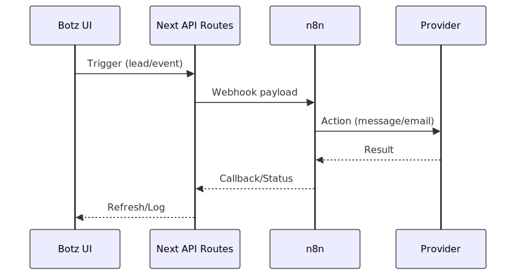

# Botz - Integraciones

## WhatsApp
- Providers: Evolution API y/o Meta.
- Uso: notificaciones, seguimiento, plantillas.
- Recomendado: registrar acciones enviadas en `lead_logs`.

## Email
- SMTP: Zoho (o Resend).
- Uso: confirmaciones, seguimiento, notificaciones.

## Google
- OAuth: login/consent y callbacks.
- Uso: Gmail/Calendar segun endpoints.

## Stripe
- Planes y limites.
- Webhooks: actualizacion de suscripcion.
- Nunca guardar secretos en frontend; solo server env.

## n8n
- Orquestacion de flujos externos.
- Entrada/salida por webhooks.
- Reintentos y trazabilidad (log de ejecucion recomendado).

