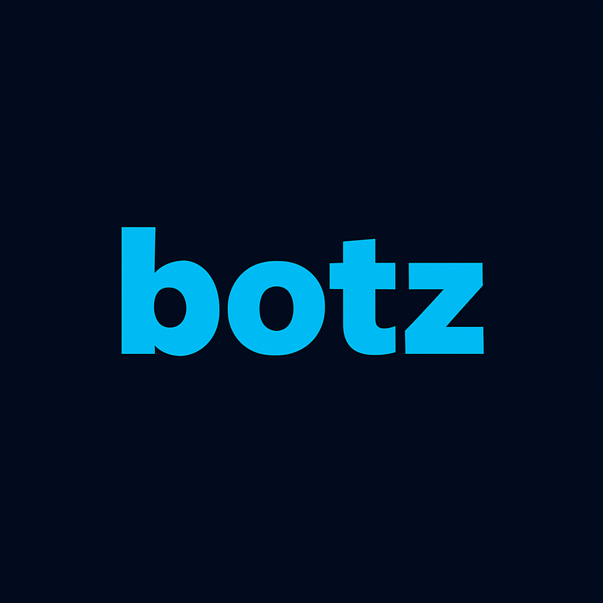

# Botz - Seguridad y Privacidad

## Principios
- Minimo privilegio (roles)
- Separacion de secretos (server env vs public env)
- Auditoria (bitacora)

## Datos sensibles
- PII: nombres, telefonos, correos
- Acceso restringido por tenant y rol

## Variables de entorno
- Publicas (frontend): `NEXT_PUBLIC_*`
- Privadas (server): Stripe secret, Supabase service role, etc.
- Nunca commitear `.env.local`.

## Recomendaciones
- Rotacion de claves
- 2FA para admins
- Registro de sesiones
