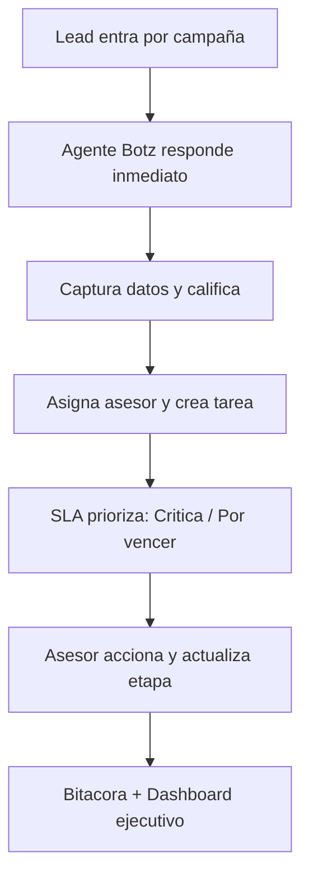

# Botz

Captura. Responde. Prioriza. Cierra.

Una plataforma comercial para equipos que reciben leads por campañas y necesitan velocidad, orden y visibilidad.

  

    
Impacto

    
Mas conversion

    
Menos leads perdidos, mejor seguimiento, mas cierres.

  

  

    
Velocidad

    
Respuesta inmediata

    
Agentes Botz atienden apenas entra el lead.

  

  

    
Control

    
SLA y tablero

    
Prioriza lo urgente y mide el desempeño.

  

# El problema que Botz resuelve

  

    
Leads perdidos

    
Llegan por campañas (Meta/Google/WhatsApp) y se quedan sin responsable o sin seguimiento.

  

  

    
Respuestas tardias

    
Si no respondes rapido, la conversacion se enfria y sube el costo por venta.

  

  

    
Prioridad difusa

    
El equipo no sabe que atender primero (urgente vs importante).

  

  

    
Sin visibilidad

    
Sin metricas claras: conversion real, pipeline, comisiones, rendimiento por canal/asesor.

  

# La solucion: Botz en 3 capas

## 1) Captura y califica con Agentes Botz

- Respuesta inmediata al lead que entra por campañas
- Captura datos clave (necesidad, presupuesto, urgencia)
- Calificacion inicial (intencion + proximo paso)
- Agenda la siguiente accion y entrega al asesor correcto

## 2) Operacion diaria sin caos

- CRM agil: busqueda, filtros, edicion rapida, perfil del lead
- Kanban por etapas: visual y simple
- Bitacora: trazabilidad real para auditoria y aprendizaje

## 3) Control ejecutivo

- Centro SLA: Criticas / Por vencer / Observacion
- Dashboard ejecutivo: ranking, conversion, pipeline, rendimiento por canal

# Indicadores (lo que mides en Botz)

Estos indicadores se calculan desde la operacion real (actividad y estados). Son el tablero para tomar decisiones.

  

    
Tiempo primera respuesta

    
Target: &lt; 5 min

    
Mejoras fuertes cuando el lead se atiende en caliente.

  

  

    
Cumplimiento SLA

    
Target: 90%+

    
Prioridad automatica: no se te vence lo importante.

  

  

    
Conversion por canal

    
Meta/Google/WA

    
Inviertes donde realmente convierte.

  

  

    
Pipeline

    
Valor en curso

    
Visibilidad de ventas futuras y proyeccion.

  

  

    
Ranking por asesor

    
Leads / cierres

    
Detecta cargas altas y mejores practicas.

  

  

    
Tasa de no respuesta

    
Baja con flujos

    
Seguimiento y recordatorios para recuperar oportunidades.

  

# Como se ve una operacion ordenada

Nota: el flujo es ilustrativo. Los indicadores se ajustan a tu operacion.

# Por que Botz

  

    
Diseno para ventas

    
No es un CRM pesado. Es ejecucion y control diario.

  

  

    
Velocidad + consistencia

    
Agentes Botz atienden y el SLA empuja el seguimiento.

  

  

    
Visibilidad real

    
Canales, asesores, pipeline, conversion y comision.

  

  

    
Adopcion rapida

    
Flujos simples: trabajar y mover etapas, sin friccion.

  

# Cierre

## Agenda una demo

En la demo te mostramos Botz con tu flujo real (campañas, SLA, asesores y tablero ejecutivo).

Contacto:

- info@botz.fyi
