# Botz - Motor Hipotecario (Calculo y Viabilidad)

El Motor Hipotecario de Botz es el componente que estima cuota, riesgo y viabilidad para un cliente (lead) con base en datos financieros. Su objetivo es:

- Acelerar el analisis inicial
- Estandarizar criterios (DTI, entrada minima, reglas por pais)
- Dejar trazabilidad del estudio
- Activar acciones automaticas (seguimiento, email, asignacion, etc.)

## Donde se usa en la herramienta

### 1) Modulo "Calculo Hipotecario" (HipotecaView)
Ubicacion: vista de calculo general.

Modos:
- Manual: se ingresa informacion y se genera una ficha.
- Lead: se conecta a un lead existente y sincroniza datos en tiempo real.

Acciones:
- Guardar en CRM: guarda inputs/resultados en el lead.
- Descargar Excel (CSV): exporta una ficha para analisis.
- Guardar PDF / Imprimir: genera una ficha imprimible desde el navegador.

### 2) Dentro del CRM (LeadDetailsDrawer)
Ubicacion: abrir un lead en CRM y entrar a "Analisis".

Acciones:
- Ejecutar estudio (calculo rapido)
- Guardar datos financieros en el lead
- Generar PDF del estudio y compartir por WhatsApp
- Guardar datos de cierre (si aplica)

## Entradas (datos que toma)

Entradas base (comunes):
- Valor de vivienda
- Ingresos mensuales
- Aportacion / cuota inicial
- Otras cuotas / deudas mensuales
- Tasa de interes
- Plazo (anos)

Entradas por pais (ejemplos):

Colombia:
- Tipo de vivienda: VIS / No VIS
- Modalidad: Credito Pesos / Leasing Habitacional / Credito UVR
- Ciudad
- Subsidio
- Antiguedad laboral (meses)
- Score crediticio (0-1000)

Espana:
- Edad
- Modo de analisis: Tasa anual fija o Euribor + diferencial
- Gastos minimos vitales (si se usa)

## Calculos principales

### 1) Cuota estimada (PMT)
Se calcula una cuota mensual estimada con la tasa anual y el plazo:

- r = tasa mensual
- n = meses del prestamo
- cuota = PMT(principal, r, n)

### 2) DTI (Debt-to-Income)
DTI estima el peso de la deuda total sobre ingresos:

- DTI = (cuota hipoteca + otras deudas) / ingresos
- Se muestra en porcentaje

### 3) LTV (Loan-to-Value)
LTV estima el porcentaje financiado vs valor del inmueble:

- LTV = monto financiado / valor vivienda

### 4) Score
El motor asigna un score interno (0-100 o equivalente) segun:

- DTI
- ingresos
- deudas
- variables por pais (ej. score crediticio, antiguedad laboral, subsidio)

## Viabilidad (resultado)

El motor marca un caso como viable/no viable segun reglas. Ejemplos comunes:

- DTI dentro del maximo permitido (segun pais)
- LTV dentro del limite (entrada minima)

Salida tipica:
- Cuota estimada
- DTI%
- LTV%
- Score
- Aprobado (SI/NO)
- Recomendacion (accion sugerida)

## Donde se guarda (trazabilidad)

### En el lead (tabla leads)
Cuando se usa en modo Lead, Botz actualiza el lead con:

- valor inmueble (ej. `precio_real` / `valor_vivienda`)
- ingresos (ej. `ingresos_netos` / `ingresos_mensuales`)
- otras cuotas (`otras_cuotas`)
- tasa (`tasa_anual` / `tasa_interes`)
- plazo (`plazo_anos`)
- cuota estimada (`cuota_estimada`)
- dti (`dti`)
- score (`score`)

Ademas actualiza timestamps cuando existen.

### Estudio PDF (CRM)
En el CRM, el estudio puede generar un PDF y guardarlo en storage (bucket de estudios) y registrar el estudio en una tabla de viabilidad (ej. `estudios_viabilidad`).

Esto permite:
- Ver el PDF desde el lead
- Compartir enlace por WhatsApp
- Guardar snapshot del caso en el momento del estudio

## Automatizaciones (captura y comunicacion)

### Lead Scoring desde la calculadora
Cuando el usuario deja sus datos (nombre + email) en el motor, Botz:

1) Calcula un lead score
2) Crea un lead en el CRM con origen "Calculadora Hipoteca Botz"
3) Define calificacion y proxima accion recomendada
4) Envia un email automatico personalizado (multi-tenant)

### Email automatico (multi-tenant)
El email se envia usando:
- configuracion del tenant (si existe)
- o fallback a SMTP por defecto (variables de entorno)

## Pantallas clave (resumen)

- Calculo Hipotecario: simulacion, score, recomendaciones y export.
- CRM Lead Details: analisis rapido, PDF, WhatsApp, bitacora.
- Dashboard Ejecutivo: metricas DTI, valor promedio, tasa de aprobacion (si hay data).
