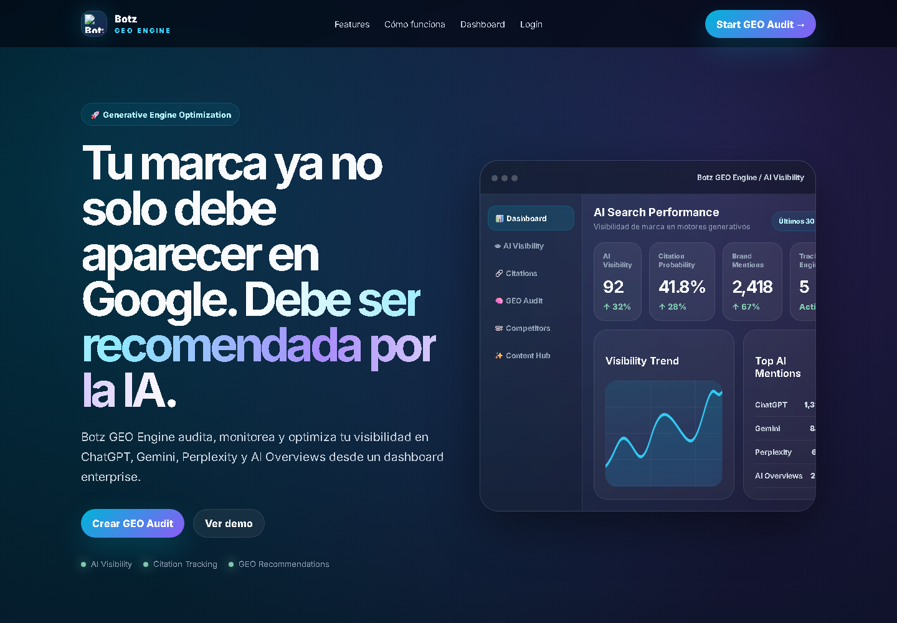
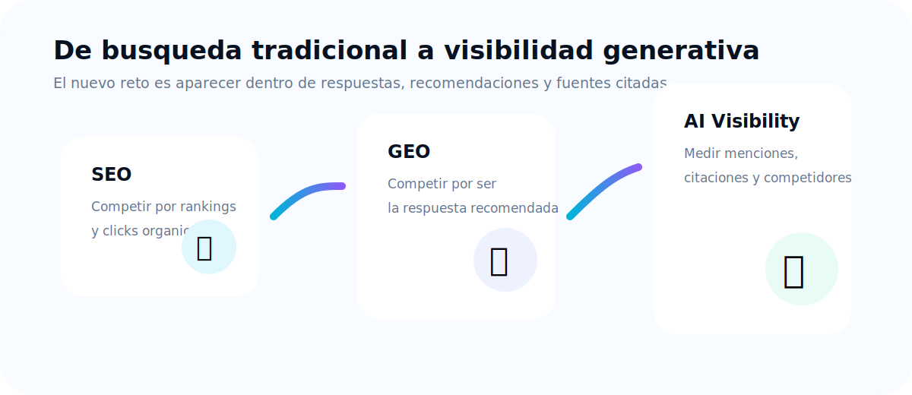
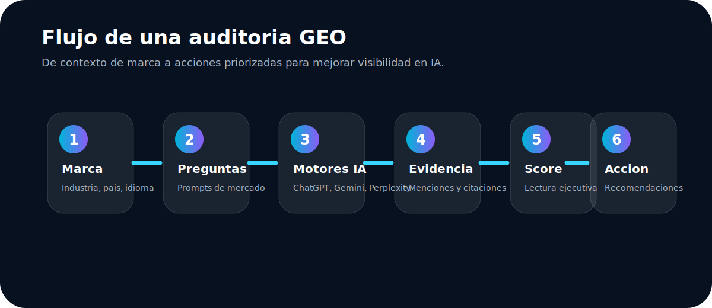
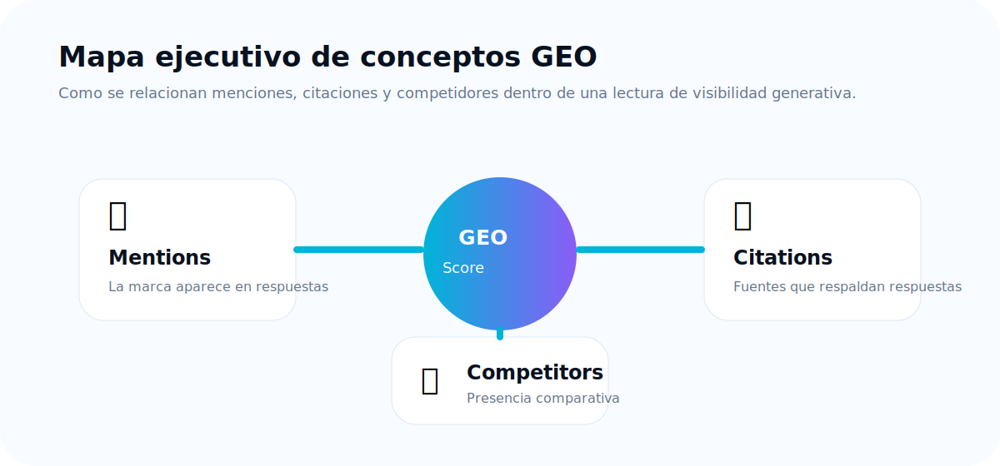
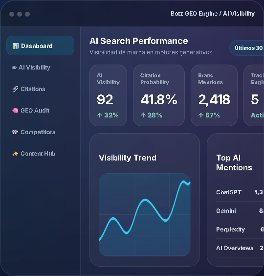

# BOTZ GEO

## Guia ejecutiva para clientes

**Generative Engine Optimization para marcas que quieren ser encontradas, citadas y recomendadas por motores de IA.**

Preparado por BOTZ  
Version ejecutiva 1.0  
Audiencia: directores, gerentes de marketing, equipos comerciales, agencias y lideres de crecimiento.

---

## Tabla de contenido

1. Que es BOTZ GEO
2. Que problema resuelve
3. Como funciona una auditoria GEO
4. Como interpretar GEO Score
5. Como interpretar AI Visibility
6. Citations, Mentions y Competitors
7. Como leer los resultados
8. Como mejorar visibilidad en ChatGPT, Gemini y Perplexity
9. Caso practico
10. FAQ ejecutivo

---

## 1. Que es BOTZ GEO

BOTZ GEO es una plataforma SaaS para medir y mejorar la presencia de una marca dentro de respuestas generadas por inteligencia artificial.

En vez de limitarse a revisar si una empresa aparece en Google, BOTZ GEO analiza si la marca aparece, es mencionada, es citada o es recomendada cuando un usuario pregunta en motores como ChatGPT, Gemini, Perplexity y AI Overviews.

El objetivo es responder tres preguntas de negocio:

- La IA conoce mi marca?
- La IA confia en mi marca lo suficiente para citarla o recomendarla?
- Mis competidores aparecen antes, mas o mejor que yo?

### Vision ejecutiva

🧠 **De buscadores a motores de respuesta**  
Los clientes ya no solo hacen busquedas tradicionales. Preguntan directamente a sistemas de IA y esperan una recomendacion clara.

📊 **De trafico a presencia generativa**  
La visibilidad ahora tambien depende de aparecer dentro de respuestas, comparaciones, listas de opciones y fuentes citadas.

🏁 **De rankings a autoridad percibida**  
Ganar no significa solo estar en una pagina de resultados. Significa que la IA entienda, mencione y respalde la marca.

---

## 2. Que problema resuelve BOTZ GEO

Las marcas estan perdiendo control sobre como son descubiertas en entornos de IA.

Un cliente puede preguntar:

- Cual es la mejor empresa para este servicio?
- Que proveedores recomiendas en mi pais?
- Que marca es mas confiable para esta necesidad?
- Compara esta empresa contra sus competidores.

Si la respuesta no menciona a la marca, cita a competidores o usa informacion incompleta, hay una perdida real de visibilidad comercial.

BOTZ GEO convierte ese problema en un sistema medible:

- Detecta si la marca aparece en respuestas de IA.
- Mide en que motores tiene presencia y en cuales esta ausente.
- Identifica si las respuestas incluyen fuentes o citaciones.
- Compara presencia contra competidores.
- Prioriza acciones para mejorar autoridad, contenido y posicionamiento.

### Grafico ejecutivo: cambio de comportamiento

---

## 3. Como funciona una auditoria GEO

Una auditoria GEO es una evaluacion de visibilidad generativa. BOTZ GEO toma la informacion principal de la marca, el sitio web, el pais, el idioma, la industria y los competidores, y la usa para consultar motores de IA con preguntas relevantes para el mercado.

### Flujo ejecutivo

### Que ocurre durante la auditoria

1. Se define el contexto de la marca.
2. Se generan preguntas representativas de usuarios reales.
3. Se consultan motores de IA seleccionados.
4. Se revisa si la marca aparece de forma espontanea o asistida.
5. Se identifican menciones, citaciones y presencia competitiva.
6. Se consolida un resultado ejecutivo.
7. Se generan recomendaciones accionables.

### Como debe interpretarse

Una auditoria no es una promesa de posicionamiento permanente. Es una fotografia del comportamiento de los motores de IA ante preguntas concretas en un momento especifico.

La recomendacion es repetir auditorias despues de implementar mejoras para observar cambios en visibilidad, citaciones y posicionamiento frente a competidores.

---

## 4. Que es GEO Score

GEO Score es el indicador principal de BOTZ GEO. Resume la fortaleza de presencia de una marca en motores de IA.

Un GEO Score alto indica que la marca tiene mejores senales de visibilidad generativa: aparece en respuestas relevantes, es reconocida por los motores, puede competir frente a alternativas y cuenta con evidencia o citaciones que refuerzan confianza.

### Lectura ejecutiva

🟢 **80 a 100: posicion fuerte**  
La marca aparece con consistencia y tiene senales positivas de autoridad en respuestas de IA.

🟡 **50 a 79: oportunidad activa**  
La marca aparece en algunos escenarios, pero todavia hay brechas en citaciones, consistencia o comparacion competitiva.

🔴 **0 a 49: visibilidad debil**  
La marca tiene baja presencia generativa o los motores no encuentran suficiente evidencia para recomendarla con confianza.

### Como usarlo

El GEO Score debe usarse como indicador de direccion, no como una metrica aislada. Lo importante es revisar que lo esta impulsando: menciones, citaciones, presencia por motor, competidores y calidad de recomendaciones.

---

## 5. Que es AI Visibility

AI Visibility mide que tan visible es una marca dentro de respuestas de inteligencia artificial.

Una marca puede tener buen SEO tradicional y aun asi baja visibilidad en IA si los motores no la mencionan, no entienden su categoria o no encuentran evidencia confiable para respaldarla.

### AI Visibility responde

- La marca aparece cuando el usuario pregunta por soluciones de su categoria?
- Aparece sin que el usuario mencione el nombre de la marca?
- Aparece cuando se compara contra competidores?
- La IA la describe correctamente?
- Hay diferencias entre ChatGPT, Gemini y Perplexity?

### Por que importa

La visibilidad en IA influye en la etapa de investigacion, comparacion y decision. Si una marca no aparece en esos momentos, puede perder demanda incluso antes de que el usuario visite Google o el sitio web.

---

## 6. Citations, Mentions y Competitors

### Citations

Las citations son fuentes que un motor de IA usa o muestra para respaldar una respuesta.

En terminos ejecutivos, una citation indica que la IA encontro una fuente que considera util para justificar o enriquecer su respuesta.

Una citation puede ser valiosa cuando apunta al sitio de la marca, a contenido propio, a una pagina de autoridad o a una referencia externa positiva.

### Mentions

Las mentions son apariciones de la marca dentro de una respuesta de IA.

Una mencion puede ser positiva, neutral o debil. Lo importante no es solo aparecer, sino analizar el contexto: si la marca aparece como recomendacion, alternativa, fuente, comparacion o simple referencia.

### Competitors

Competitors son las marcas o empresas comparadas contra la marca principal.

BOTZ GEO ayuda a identificar si los competidores aparecen mas que la marca, si son recomendados antes o si reciben mas soporte por citaciones.

### Como se conectan

---

## 7. Como interpretar los resultados

La lectura correcta combina metricas, evidencia y accion.

### Preguntas clave para direccion

1. En que motores aparece la marca?
2. En que motores esta ausente?
3. La marca aparece por su nombre o tambien por su categoria?
4. Los competidores aparecen con mas fuerza?
5. Existen citaciones que respalden a la marca?
6. La IA entiende correctamente la propuesta de valor?
7. Las recomendaciones apuntan a contenido, autoridad, comparacion o estructura?

### Senales positivas

- La marca aparece sin necesidad de mencionarla explicitamente.
- Las respuestas describen correctamente la propuesta de valor.
- Hay citaciones relevantes.
- La marca compite bien frente a alternativas.
- Los motores coinciden en reconocerla dentro de la categoria.

### Senales de alerta

- La marca no aparece en preguntas de categoria.
- Los competidores aparecen con mas frecuencia.
- Las respuestas no citan fuentes propias o confiables.
- La IA confunde el posicionamiento o industria.
- Hay diferencias fuertes entre motores.

### Captura de referencia del producto

---

## 8. Como mejorar visibilidad en ChatGPT, Gemini y Perplexity

Mejorar visibilidad GEO requiere hacer que la marca sea mas facil de entender, verificar y recomendar.

### Acciones prioritarias

🎯 **Clarificar posicionamiento**  
La pagina principal debe explicar con precision que hace la empresa, para quien, en que pais o mercado, y que la diferencia.

🔎 **Crear contenido para preguntas reales**  
Las paginas deben responder preguntas que un usuario haria a un motor de IA: comparaciones, mejores proveedores, alternativas, beneficios, casos de uso y preguntas frecuentes.

🏁 **Construir paginas comparativas**  
Si los competidores aparecen en respuestas, la marca necesita contenido que explique diferencias, ventajas, limitaciones y criterios de decision.

🔗 **Fortalecer fuentes citables**  
Casos de exito, datos verificables, testimonios, paginas de producto, guias y contenido estructurado facilitan que la IA use la marca como referencia.

🧩 **Mejorar consistencia semantica**  
La marca debe usar lenguaje consistente sobre categoria, industria, beneficios y mercados objetivo.

📚 **Publicar evidencia comercial**  
La IA tiende a favorecer contenido que reduce ambiguedad: pruebas, resultados, clientes, cobertura, certificaciones, comparativas y autoridad externa.

### Por motor

**ChatGPT**  
Priorizar claridad de marca, contenido explicativo, autoridad tematica y respuestas completas a preguntas frecuentes.

**Gemini**  
Reforzar presencia web, estructura de contenido, consistencia con busqueda y senales faciles de asociar a entidad, categoria y mercado.

**Perplexity**  
Invertir en contenido citable, fuentes claras, paginas con informacion verificable y referencias que puedan aparecer como respaldo.

---

## 9. Caso practico

### Situacion inicial

Una empresa B2B quiere saber si aparece cuando un comprador pregunta a la IA por proveedores de su categoria en su pais.

La auditoria muestra:

- La marca aparece cuando se pregunta directamente por ella.
- No aparece con fuerza cuando la pregunta es generica por categoria.
- Un competidor aparece con mas frecuencia en comparaciones.
- Hay pocas citaciones hacia el sitio de la marca.
- La IA entiende parcialmente la propuesta de valor, pero no reconoce suficientes pruebas.

### Interpretacion

La empresa tiene reconocimiento asistido, pero baja visibilidad espontanea. Esto significa que la IA puede hablar de la marca si el usuario la menciona, pero no necesariamente la recomienda cuando el usuario aun no sabe que proveedor elegir.

### Plan de mejora recomendado

1. Ajustar la pagina principal para explicar mejor categoria, pais, industria y propuesta de valor.
2. Crear una pagina de comparacion contra alternativas conocidas.
3. Publicar una guia tipo “mejores proveedores de la categoria en el pais”.
4. Fortalecer casos de uso y evidencia comercial.
5. Crear una seccion de preguntas frecuentes orientada a decisiones de compra.
6. Ejecutar una nueva auditoria para medir avance.

### Resultado esperado

La marca deberia aumentar menciones en preguntas genericas, mejorar cobertura de citaciones y competir con mas claridad frente a alternativas.

---

## 10. FAQ ejecutivo

### BOTZ GEO reemplaza el SEO tradicional?

No. BOTZ GEO complementa el SEO. SEO ayuda a posicionar contenido en buscadores tradicionales; GEO ayuda a entender y mejorar como la marca aparece en respuestas generadas por IA.

### Un GEO Score bajo significa que la marca esta mal posicionada en Google?

No necesariamente. Puede haber buen posicionamiento SEO y baja visibilidad en IA. Los motores generativos evaluan y sintetizan informacion de forma distinta.

### Por que mi marca aparece en un motor y no en otro?

Cada motor usa modelos, fuentes, criterios y mecanismos diferentes. Por eso BOTZ GEO analiza resultados por motor y no solo una vision agregada.

### Que es mas importante: menciones o citaciones?

Ambas son importantes. Las menciones indican presencia. Las citaciones ayudan a respaldar confianza y verificabilidad.

### Cada cuanto se debe auditar?

La recomendacion ejecutiva es auditar antes de implementar cambios, despues de publicar mejoras importantes y de forma periodica para monitorear evolucion competitiva.

### BOTZ GEO garantiza aparecer en ChatGPT, Gemini o Perplexity?

No. Ninguna plataforma puede garantizar una recomendacion permanente en motores externos. BOTZ GEO mide, diagnostica y prioriza acciones para aumentar probabilidad de visibilidad y citacion.

### Que equipos deben usar BOTZ GEO?

Marketing, contenido, SEO, growth, ventas consultivas, producto y direccion comercial.

### Que entregable debe recibir la direccion?

Un resumen ejecutivo con GEO Score, AI Visibility, motores con mejor y peor desempeno, competidores dominantes, citaciones relevantes y acciones prioritarias.

---

## Cierre

BOTZ GEO ayuda a las marcas a competir en una nueva capa de descubrimiento: la recomendacion generada por inteligencia artificial.

La prioridad no es solo aparecer. Es ser entendido, citado y recomendado con suficiente claridad para influir en decisiones de compra.

**BOTZ GEO convierte esa visibilidad en un proceso medible, comparable y accionable.**
