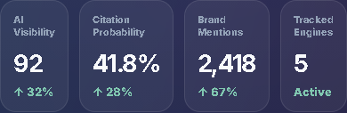
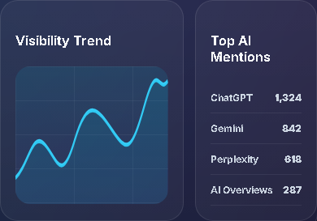
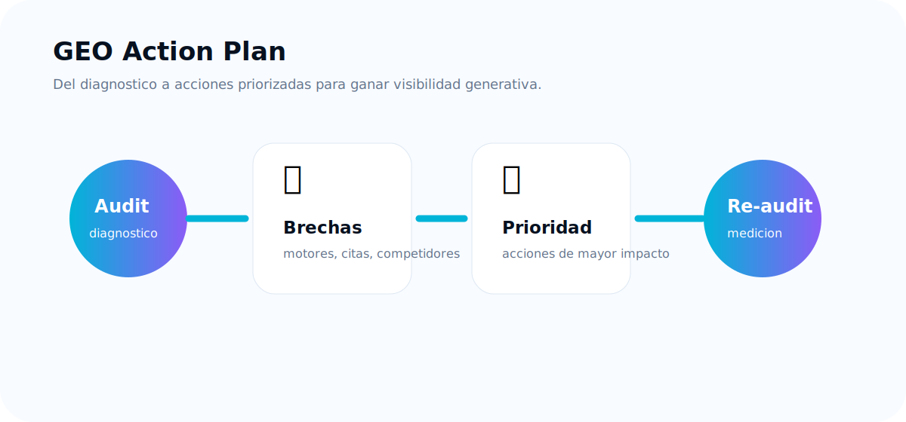
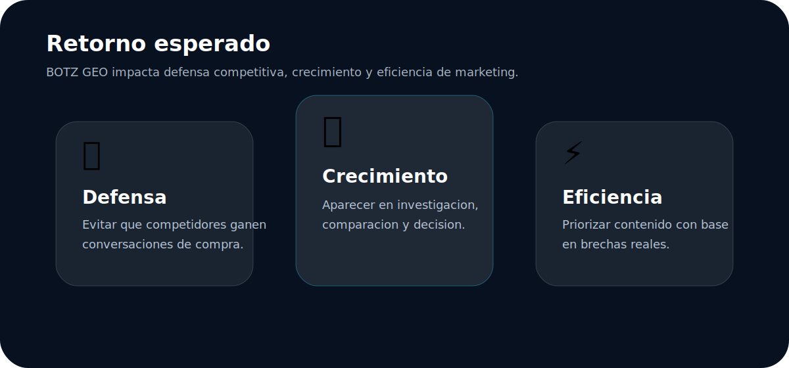
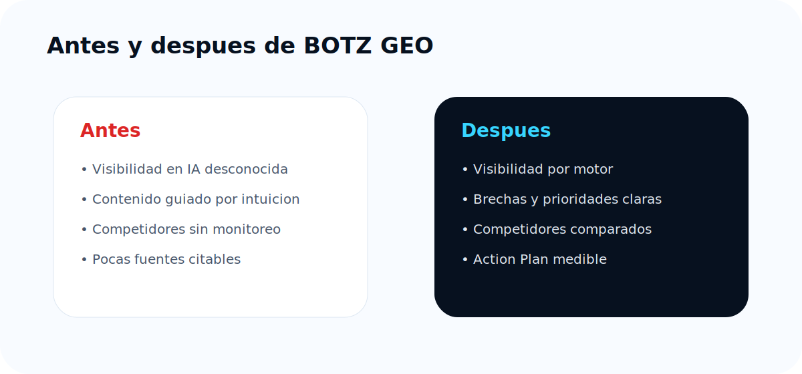

# BOTZ GEO

## Guia comercial premium para clientes

**La plataforma para que una marca sea encontrada, entendida, citada y recomendada por motores de inteligencia artificial.**

Preparado por BOTZ  
Version comercial premium 2.0  
Audiencia: CEOs, direccion general, marketing, growth, ventas consultivas y agencias.

---

## Tabla de contenido

1. Resumen ejecutivo
2. Que problema resuelve BOTZ GEO
3. Como funciona una auditoria GEO
4. Por que BOTZ GEO es diferente
5. Como leer GEO Score y AI Visibility
6. Citations, Mentions y Competitors
7. Capturas reales del dashboard
8. GEO Action Plan
9. Retorno esperado
10. Caso real usando BOTZ GEO
11. Comparativa antes y despues
12. Como mejorar visibilidad en ChatGPT, Gemini y Perplexity
13. FAQ ejecutivo

---

## 1. Resumen ejecutivo

BOTZ GEO ayuda a responder una pregunta critica para cualquier CEO: **cuando un comprador le pregunta a la IA por una solucion como la mia, mi marca aparece o mis competidores ganan la recomendacion?**

La busqueda esta cambiando. Los compradores ya no solo revisan una pagina de resultados; preguntan a ChatGPT, Gemini, Perplexity y AI Overviews. Esos motores resumen opciones, comparan proveedores y citan fuentes. Si la marca no aparece ahi, pierde influencia antes de que el cliente visite el sitio web.

BOTZ GEO convierte esa nueva capa de descubrimiento en un sistema de gestion comercial:

- Mide visibilidad de marca en respuestas de IA.
- Identifica menciones, citaciones y competidores.
- Muestra donde la marca gana, pierde o esta ausente.
- Prioriza acciones para mejorar autoridad, contenido y recomendacion.
- Permite repetir auditorias para observar avance.

---

## 2. Que problema resuelve BOTZ GEO

El problema no es solo tener trafico. El problema es estar presente cuando el comprador pide una recomendacion.

Un prospecto puede preguntar:

- Cual es el mejor proveedor para esta necesidad?
- Que empresa recomiendas en mi pais?
- Que alternativas existen frente a esta marca?
- Que proveedor tiene mas autoridad o mejores pruebas?

Si la IA menciona competidores, ignora la marca o no encuentra fuentes confiables para respaldarla, existe una perdida real de demanda, reputacion y oportunidades comerciales.

BOTZ GEO permite ver ese riesgo antes de que se convierta en ventas perdidas.

---

## 3. Como funciona una auditoria GEO

Una auditoria GEO evalua como aparece la marca dentro de respuestas generadas por IA. El proceso parte del contexto de negocio: marca, dominio, pais, idioma, industria y competidores.

Luego BOTZ GEO consulta motores de IA con preguntas representativas de mercado y consolida una lectura ejecutiva de visibilidad.

### Que entrega una auditoria

- Una lectura de presencia de marca.
- Visibilidad por motor de IA.
- Evidencia de menciones y citaciones.
- Comparacion contra competidores.
- Recomendaciones accionables.
- Base para medir avance en auditorias futuras.

Una auditoria no es una promesa de posicionamiento permanente. Es una fotografia de como responden los motores de IA ante preguntas concretas en un momento especifico.

---

## 4. Por que BOTZ GEO es diferente

BOTZ GEO no es un reporte SEO tradicional ni una herramienta generica de contenido. Esta disenado para entender como una marca compite dentro de respuestas generadas por IA.

### Diferenciales clave

🧠 **Mide recomendaciones, no solo rankings**  
El valor esta en saber si la IA recomienda, menciona o cita a la marca cuando el comprador pide ayuda para decidir.

🔎 **Trabaja con preguntas de negocio**  
La auditoria parte de industria, pais, idioma, competidores y contexto comercial.

🏁 **Incluye inteligencia competitiva**  
No basta con aparecer. BOTZ GEO ayuda a ver si los competidores aparecen mas, mejor o antes.

🔗 **Se enfoca en evidencia citable**  
Las respuestas de IA ganan fuerza cuando encuentran fuentes claras, confiables y faciles de usar.

📌 **Termina en un plan de accion**  
El objetivo no es solo diagnosticar; es priorizar mejoras concretas para aumentar visibilidad.

---

## 5. Como leer GEO Score y AI Visibility

### GEO Score

GEO Score es el indicador principal de fortaleza generativa de una marca. Resume si la marca aparece, si es reconocida por motores de IA, si compite frente a alternativas y si cuenta con evidencia que respalde confianza.

Lectura ejecutiva:

- **80 a 100:** posicion fuerte.
- **50 a 79:** oportunidad activa.
- **0 a 49:** visibilidad debil.

### AI Visibility

AI Visibility mide que tan visible es la marca dentro de respuestas de IA. Ayuda a responder si la marca aparece por categoria, por nombre, frente a competidores y por motor.

El CEO debe leer estas metricas como un tablero de direccion: no solo muestran estado actual, sino prioridad comercial.

---

## 6. Citations, Mentions y Competitors

### Citations

Son fuentes que la IA usa o muestra para respaldar una respuesta. Cuando la marca tiene fuentes citables, aumenta su capacidad de ser tomada como referencia confiable.

### Mentions

Son apariciones de la marca dentro de una respuesta. Una mencion puede ser una recomendacion, una alternativa, una comparacion o una referencia neutral.

### Competitors

Son marcas que aparecen compitiendo por la misma recomendacion. Si los competidores aparecen mas que la marca, existe una brecha de visibilidad generativa.

---

## 7. Capturas reales del dashboard

El dashboard de BOTZ GEO esta disenado para que la direccion vea rapidamente estado, tendencia y prioridades.

### Que debe mirar un CEO

1. Si la marca esta ganando o perdiendo presencia.
2. Que motores reconocen mejor la marca.
3. Donde existen brechas de citacion.
4. Que competidores aparecen con mas fuerza.
5. Que acciones tienen mayor prioridad.

---

## 8. GEO Action Plan

El GEO Action Plan convierte la auditoria en decisiones concretas. Su proposito es responder: **que hacemos ahora para que la IA entienda, cite y recomiende mejor la marca?**

### Acciones tipicas

- Optimizar la pagina principal para explicar categoria, mercado y propuesta de valor.
- Crear paginas comparativas contra competidores relevantes.
- Publicar contenido que responda preguntas reales de compra.
- Fortalecer casos de exito, pruebas, testimonios y evidencia comercial.
- Mejorar FAQs y estructura de contenido para que los motores entiendan mejor la marca.
- Repetir auditoria para medir avance.

El Action Plan evita que el equipo se quede en dashboards. Convierte hallazgos en trabajo priorizado.

---

## 9. Retorno esperado

El retorno de BOTZ GEO se entiende en tres niveles: defensa, crecimiento y eficiencia.

### Defensa

Evita que competidores capturen conversaciones de compra en motores de IA sin que la marca lo sepa.

### Crecimiento

Aumenta la probabilidad de aparecer en momentos de investigacion, comparacion y decision.

### Eficiencia

Prioriza contenido y mejoras con base en brechas reales, no en intuiciones aisladas.

### Indicadores ejecutivos a monitorear

- Mejora del GEO Score.
- Mayor AI Visibility por motor.
- Mas menciones en preguntas genericas.
- Mas citaciones hacia fuentes relevantes.
- Menor brecha frente a competidores.
- Recomendaciones implementadas y auditadas nuevamente.

---

## 10. Caso real usando BOTZ GEO

Caso basado en el flujo real de uso de BOTZ GEO: una empresa B2B con presencia digital queria entender por que sus competidores aparecian en conversaciones de IA mientras su marca dependia casi por completo de busquedas directas.

### Situacion inicial

- La marca aparecia cuando el usuario escribia su nombre.
- En preguntas genericas de categoria, los competidores dominaban.
- Habia pocas fuentes claras para que la IA citara al sitio.
- La propuesta de valor no estaba suficientemente explicada para un comprador nuevo.

### Lectura BOTZ GEO

La marca tenia reconocimiento asistido, pero baja visibilidad espontanea. En otras palabras: la IA podia hablar de la marca si el usuario ya la conocia, pero no necesariamente la recomendaba cuando el comprador aun estaba explorando opciones.

### Acciones recomendadas

1. Reescribir el posicionamiento principal con categoria, pais, cliente ideal y diferenciador.
2. Crear una pagina comparativa frente a alternativas.
3. Publicar contenido para preguntas de compra.
4. Fortalecer evidencia: casos, pruebas, testimonios y FAQs.
5. Repetir auditoria para medir avance.

### Valor para direccion

El equipo paso de una conversacion subjetiva sobre contenido a una agenda clara de visibilidad generativa.

---

## 11. Comparativa antes y despues

### Antes

- No se sabia si la marca aparecia en IA.
- El equipo optimizaba contenido por intuicion.
- La comparacion contra competidores era manual.
- No habia una lectura clara de citaciones.
- La direccion no tenia un tablero para decidir prioridades.

### Despues

- La marca conoce su visibilidad por motor.
- El equipo sabe que preguntas y brechas atacar.
- Los competidores se monitorean como parte del diagnostico.
- Las citaciones se vuelven una prioridad de autoridad.
- La direccion cuenta con un Action Plan medible.

---

## 12. Como mejorar visibilidad en ChatGPT, Gemini y Perplexity

### ChatGPT

Priorizar claridad de marca, contenido explicativo, autoridad tematica, preguntas frecuentes completas y paginas que respondan como un experto humano responderia a un comprador.

### Gemini

Reforzar consistencia web, estructura de contenido, relacion entre marca, categoria, mercado y fuentes externas que ayuden a validar entidad y relevancia.

### Perplexity

Invertir en contenido verificable y facil de citar: guias, comparativas, casos de uso, datos, paginas con fuentes claras y respuestas directas.

### Principio central

La IA recomienda mejor lo que entiende mejor. Y entiende mejor aquello que esta bien explicado, bien estructurado y respaldado por evidencia.

---

## 13. FAQ ejecutivo

### BOTZ GEO reemplaza el SEO tradicional?

No. Lo complementa. SEO trabaja busqueda tradicional; GEO trabaja presencia en respuestas generadas por IA.

### Un GEO Score bajo significa mal SEO?

No necesariamente. Puede haber buen SEO y baja visibilidad en IA.

### Por que aparezco en un motor y no en otro?

Cada motor usa fuentes, modelos y criterios diferentes. Por eso BOTZ GEO analiza resultados por motor.

### Que importa mas: mentions o citations?

Ambas. Las menciones indican presencia; las citaciones respaldan confianza y verificabilidad.

### BOTZ GEO garantiza aparecer en ChatGPT, Gemini o Perplexity?

No. Ninguna plataforma puede garantizar una recomendacion permanente en motores externos. BOTZ GEO mide, diagnostica y prioriza acciones para aumentar probabilidad de visibilidad y citacion.

### Que debe recibir un CEO?

Una lectura clara de riesgo y oportunidad: GEO Score, AI Visibility, competidores dominantes, citaciones relevantes, brechas prioritarias y Action Plan.

---

## Cierre

BOTZ GEO ayuda a las marcas a competir en una nueva capa de descubrimiento: la recomendacion generada por inteligencia artificial.

El valor para direccion es simple: saber si la empresa esta presente donde los compradores empiezan a preguntar, y tener un plan claro para ganar esa presencia.

**BOTZ GEO convierte la visibilidad en IA en una ventaja comercial medible.**
